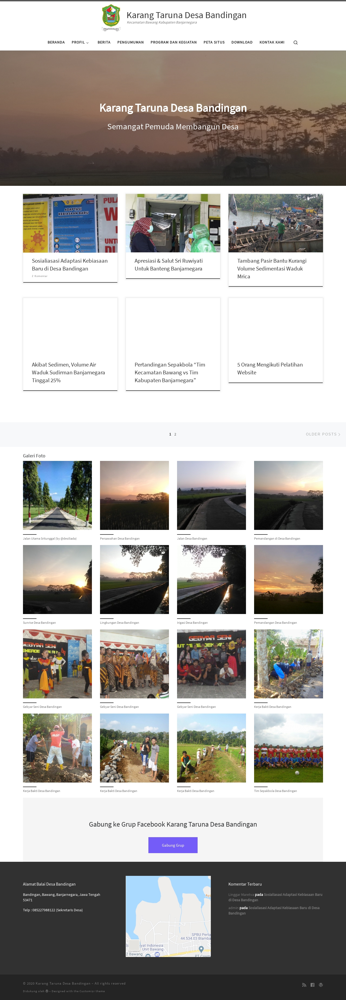

# Website-Karang-Taruna-Desa-Bandingan

## About the Project
**Website Karang Taruna Desa Bandingan** merupakan project yang dibuat dalam rangka **Kuliah Kerja Nyata (KKN)** di Desa Bandingan, Kec. Bawang, Kab. Banjarnegara pada tahun 2020. **Website Karang Taruna Desa Bandingan** diperuntukan untuk memenuhi kebutuhan akan informasi Desa Bandingan kepada masyarakat Desa Bandingan terutama yang berhubungan dengan kegiatan para pemuda di Desa Bandingan (Karang Taruna). Sehingga akan mempermudah masyarakat Desa Bandingan dalam mengakses dan mendapatkan informasi yang tepat, tanpa perlu pergi ke keluarahan/ Balai desa. Selain itu website ini juga diperuntukkan sebagai branding dari Karang Taruna Desa Bandingan kepada masyarakat luar.

## Screenshots
  Homepage | Example Posts
  :-------------------------:|:-------------------------:
    |  

## Live Website Link
Website Karang Taruna Desa Bandingan: http://tunasbandingan.xyz/ (*inactive*)

## Features
* Add, Edit, and Delete Posts
* Add, Edit, and Delete Pages
* View Posts
* View Pages
* Image Gallery
* Customize Widgets
* Customize Navigation Menu
* Perform Search Query

## Technology Used
* Apache Web Server
* CMS Wordpress
* PHP
* MySQL (phpMyAdmin)

## Installation
  * Setup an **Apache Web Server** & **phpMyAdmin**
  * Upload the database [**`wordpresskarangtaruna.sql`**](database/wordpresskarangtaruna.sql) in your **phpMyAdmin** dashboard (Open **Import** tab, and upload the file there)
  * Upload all files in [**`website`**](website) folder into your web **main folder (public_html)**
  * Open the website on **your-website-url.com**
  * The admin page will be on **your-website-url.com/wp-admin**

## Usage
* Manual Website Karang Taruna Desa Bandingan: https://www.youtube.com/playlist?list=PL6p_aLr-Ydx4uIeMmIYMg8m6Dn0v2qwUg
* Admin Login Page: **your-website-url.com/wp-admin** (Change `your-website-url` with your own url, if you installed it on localhost, change it to `localhost`)
* Admin Account:
  * Username: **admin**
  * Password: **#DesaBandingan123**
